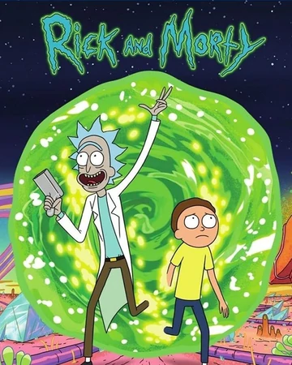

# Jogo da Memória Rick & Morty

Bem-vindo ao Jogo da Memória Rick & Morty! Este é um jogo da memória simples baseado no popular desenho animado Rick & Morty. O objetivo do jogo é encontrar e combinar pares de cartas iguais. Boa sorte e divirta-se!

Este projeto é um jogo da memória onde os jogadores precisam combinar pares de cartas com imagens dos personagens Rick & Morty. O jogo é implementado usando [tecnologias e frameworks específicos] e é uma ótima maneira de praticar suas habilidades de programação e design de jogos.

## Funcionalidades

- **Cartas Temáticas**: Imagens dos personagens Rick & Morty.
- **Modo de Jogo**: Encontre e combine pares de cartas.
- **Contador de Tentativas**: Mostra o número de tentativas feitas.
- **Cronômetro**: Exibe o tempo decorrido desde o início do jogo.
- **Tela de Vitória**: Mensagem de parabéns quando todos os pares são encontrados.

## Linguagens de Programação

- Este projeto usa as seguintes linguagens de programação:

- **HTML**: Estruturação do conteúdo das páginas.
- **CSS**: Estilização visual e design das páginas.
- **JavaScript**: Lógica do jogo e interatividade.
